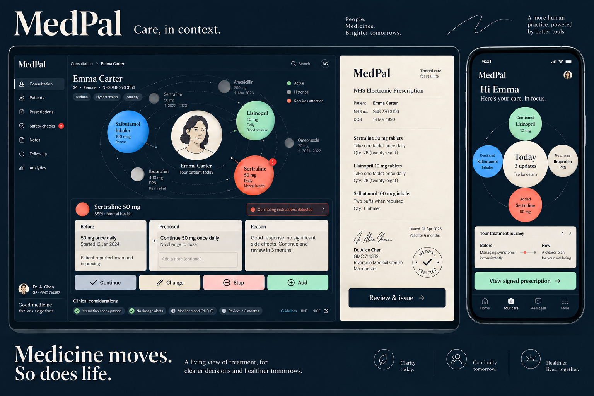
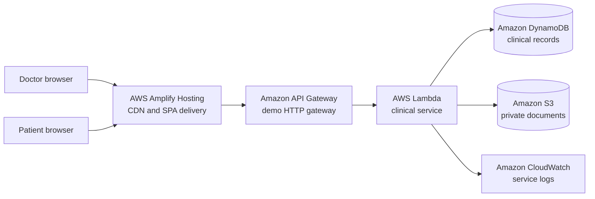

# MedPal

### Care, in context.

MedPal is a consent-first digital prescribing platform for independent clinics. It gives doctors a structured workspace for reviewing a patient's active medicines and issuing a clear prescription, while giving patients a permanent record of what changed, why it changed, and who made the decision.

[**Open the live AWS demo**](https://demo.dperk24dvwjgp.amplifyapp.com) · [Architecture](docs/ARCHITECTURE.md) · [Submission write-up](SUBMISSION.md)



> **Demonstration notice:** MedPal currently uses fictional data, on-screen login codes, and simulated doctor credential verification. It is not a clinical service. Do not enter real personal or health information. Generated prescriptions demonstrate an electronic issuance record and do not claim a certificate-based digital signature.

## Why MedPal exists

The idea came from a four-hour hospital visit for an MRI. The required paper prescription had been left at home, so a new consultation had to be arranged solely to obtain another one. The medical instruction already existed, but it was trapped on paper when it was needed.

Large hospital groups often provide their own patient apps, while independent clinics still depend heavily on handwritten prescriptions and a patient's memory of previous treatment. That creates three recurring problems:

- patients can lose the only usable copy of a prescription;
- doctors may have to reconstruct active treatment from incomplete information; and
- when treatment changes, patients may not understand what was continued, changed, stopped, or added.

MedPal focuses on that prescription lifecycle. It is not a hospital-management suite.

## What the product does

### For doctors

- Create a professional profile and upload a credential document.
- Find a patient by phone number without seeing medical history yet.
- Request access for one consultation.
- Enter the patient's single-use authorization code.
- Review active and historical medicines.
- Continue, change, stop, or add medicines with a recorded reason.
- Save a consultation draft and safely resume it.
- Review and issue a versioned prescription on the clinic's letterhead.

### For patients

- Create an account and choose a personal avatar.
- Approve or decline each consultation request.
- Share a short-lived code while present at the consultation.
- See active medicines and prescription history.
- Understand the result through a **What changed** view.
- Open, print, or download the issued prescription.

New patient accounts begin empty. MedPal never inserts a sample prescription into a real demo journey.

## The three-minute journey

1. A doctor signs in, completes their profile, uploads a fictional certificate, and watches the clearly labelled verification simulation.
2. The doctor looks up a patient by phone number and requests consultation access.
3. The patient receives an in-app request and approves it.
4. MedPal shows the patient a six-digit, single-use consultation code.
5. The doctor enters the code and can then see the patient's current medicines.
6. The doctor continues one medicine, changes another, and adds a new medicine.
7. The doctor reviews and issues the prescription.
8. The patient sees **What changed** and opens the generated prescription.

The doctor and patient can use separate browsers or devices. The patient dashboard checks for new in-app requests every two seconds and when the window regains focus.

## AWS architecture

MedPal is entered in the **Ship It** track and is deployed on AWS. The hosted demonstration follows this request path:



The repository also contains the production-oriented identity and API path built with Amazon Cognito, AWS AppSync, and Amplify Data. The public hackathon demo exposes a separate, explicitly enabled API Gateway route so evaluators can complete the journey without receiving real SMS messages or presenting an actual medical credential.

| AWS service                | Role in MedPal                                                                            | Why it fits                                                                    |
| -------------------------- | ----------------------------------------------------------------------------------------- | ------------------------------------------------------------------------------ |
| AWS Amplify Hosting        | Builds and serves the React application                                                   | Managed deployment, CDN delivery, HTTPS, and SPA hosting                       |
| Amazon API Gateway         | Public demo API boundary                                                                  | A small HTTP surface in front of the clinical service                          |
| AWS Lambda                 | Runs authorization, consultation, and prescription rules                                  | Keeps sensitive decisions on the server and scales without servers to manage   |
| Amazon DynamoDB            | Stores profiles, access grants, consultations, decisions, notifications, and audit events | Transactional writes, conditional version checks, and efficient indexed lookup |
| Amazon S3                  | Stores private credential files and generated prescriptions                               | Private object storage with short-lived signed access                          |
| Amazon Cognito             | Production phone-based identity path                                                      | Verified identity tokens and role-aware API access                             |
| AWS AppSync / Amplify Data | Production typed API and data model                                                       | Connects authenticated clients to the same Lambda-backed clinical operations   |
| Amazon CloudWatch          | Lambda logging and operational visibility                                                 | Central diagnostics without exposing internal errors to users                  |

Read [the architecture document](docs/ARCHITECTURE.md) for the request flows, data model, security controls, deployment modes, and design trade-offs.

## Trust and safety controls

Clinical access is enforced by the backend rather than hidden only in the interface.

- A doctor cannot read medical history until the patient authorizes that specific consultation.
- Consultation codes are salted and hashed, expire after five minutes, allow five attempts, and work once.
- Authorization belongs to one doctor, one patient, and one consultation.
- Closing a consultation revokes access.
- Draft writes use record revisions to prevent silent overwrites.
- Issuance stores a fixed prescription snapshot and integrity digest.
- Credential documents and prescription PDFs remain private in S3.
- Uploads are limited to supported file types, capped at 10 MB, and checked by file signature.
- Signed download links expire quickly.
- Security headers restrict framing, origins, browser permissions, and executable content.
- Audit events record important access and prescription actions.

These controls demonstrate the intended product boundary. Regulatory validation, real medical-council verification, consent policy, clinical safety review, and certificate-based signing would still be required before production use.

## Design direction

MedPal uses a midnight-navy surface, warm paper prescription, serif display type, and a medicine constellation that keeps the patient at the centre. The constellation is functional: colour and position help distinguish active, historical, and attention-needed medicines. Supporting panels translate that visual model into explicit decisions for accessibility and clinical clarity.

The UI is designed around four principles:

1. **Consent is visible.** Access begins with a patient action.
2. **Changes are explained.** Every medicine is expressed as before, proposed, and reason.
3. **Issuance feels deliberate.** The final review separates an editable draft from an issued record.
4. **The patient sees the same truth.** The doctor's decisions become a plain-language What changed view.

Approved design artefacts and the screen inventory are available in [`design/`](design/).

## Run locally

### Requirements

- Node.js 22.12 or newer
- npm

No AWS account, credentials, or SMS provider is needed for the local demonstration.

```bash
npm ci
npm run demo
```

Open [http://127.0.0.1:4180](http://127.0.0.1:4180).

Local records are stored in the ignored `.medpal-demo` directory. Sessions last 12 hours or until the server restarts. Sign in again with the same fictional phone number to recover stored records.

### Suggested local walkthrough

1. Choose **Doctor** and sign in with a fictional number such as `9000000001`.
2. Enter the demo code shown on screen.
3. Complete the doctor profile and use the included sample certificate.
4. Open a patient window and sign in with another number such as `9000000002`.
5. Complete the patient's empty profile.
6. Return to the doctor window and request access for that patient.
7. Approve the request as the patient and enter the displayed code as the doctor.
8. Create, review, and issue a prescription.
9. Return to the patient window to view What changed and download the PDF.

Hosted and local records are separate. Phone numbers are fictional identifiers in demo mode and are not verified identities.

## Verification

```bash
npm test
npm run lint
npm run build:demo
npx tsc --noEmit -p amplify/tsconfig.json
```

With the local demo running in another terminal:

```bash
node scripts/check-demo.mjs
```

The end-to-end check creates fresh fictional accounts and verifies:

- an empty new-patient state;
- credential upload and simulated verification;
- blocked medical history before consent;
- single-use consultation authorization;
- draft persistence and stale-write protection;
- immutable prescription issuance;
- patient-side updates;
- private PDF access; and
- access revocation when the consultation closes.

Unit tests also cover OTP behaviour, medicine editing, domain rules, camera failure handling, and page-level state updates.

## Repository map

```text
amplify/
  auth/                 Cognito phone authentication configuration
  data/                 Amplify Data schema and authorization rules
  functions/clinical/   Lambda handler, clinical engine, policy, storage, tests
  storage/              Private S3 resource
demo/                   Local disk-backed adapter for the same clinical engine
design/                 Research, design system, approved concepts, screen mockups
docs/                   Architecture documentation
scripts/                Automated demo-journey verification
shared/                 Shared domain types
src/                    React application, components, pages, state, API clients
```

The clinical engine is shared by the local and AWS adapters. This keeps the consent, immutability, and medication-decision rules consistent across environments.

## Deployment notes

The public demo gateway is provisioned only when `MEDPAL_DEMO=true` is explicitly set:

```bash
MEDPAL_DEMO=true AWS_REGION=ap-south-1 \
  npx ampx sandbox --once \
  --identifier medpal-product \
  --outputs-format json \
  --outputs-out-dir .

npm run build:demo
```

Deploy `dist/` through Amplify Hosting with SPA fallback to `/index.html` and the response headers in [`customHttp.yml`](customHttp.yml). `amplify_outputs.json` contains public service configuration and no AWS credentials; a new backend deployment regenerates it.

`npm run dev` and `npm run build` use the Cognito/AppSync path. `npm run demo` and `npm run build:demo` use the explicitly labelled demonstration path.

## Current limitations

- Login OTP delivery and doctor credential verification are simulated in the public demo.
- In-app notifications use short polling rather than push subscriptions.
- RxNorm autocomplete is useful for demonstration but is US-focused and is not a complete Indian medicine catalogue; manual entry remains available.
- The generated PDF uses a standard Latin font. The browser print view preserves Unicode content.
- The current deployment is a hackathon sandbox, not a production medical system.

## Hackathon submission

MedPal was built as a solo project for [First Commit, part of the WeMakeDevs Bharat Builds Tour](https://www.wemakedevs.org/aws/first-commit). One submission is considered for Ship It, Build It, and Best UI; MedPal's live deployment targets Ship It and Best UI.

The event requires a public repository, a YouTube demonstration under three minutes, and a short write-up explaining the problem, the build, and where AWS fits. The prepared write-up is in [`SUBMISSION.md`](SUBMISSION.md). AWS Builder Center student verification is complete.

## Tools, credits, and attribution

- OpenAI Codex was used for product research, design exploration, implementation assistance, debugging, and documentation. All generated work was reviewed and tested by the builder.
- OpenAI image generation was used during visual concept exploration; these images are stored under `design/`.
- Medicine search uses the public [U.S. National Library of Medicine RxNorm API](https://lhncbc.nlm.nih.gov/RxNav/APIs/RxNormAPIs.html).
- The application is built with the open-source packages declared in [`package.json`](package.json), each under its respective licence.
- All names, clinics, credentials, medical details, and prescription examples used in the demo are fictional.

Project licensing will be finalized before the repository is published publicly.
