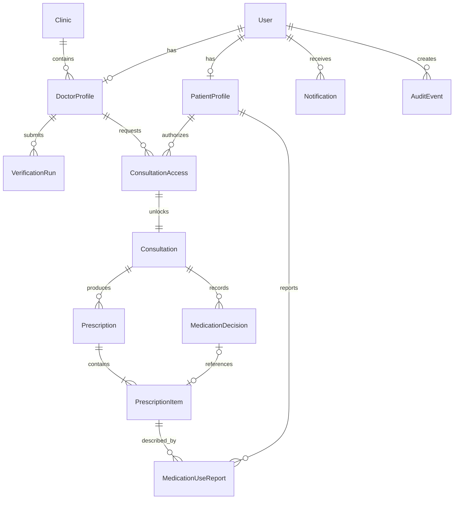

# MedPal Data Model v1 — Proposed for Review

## Core rule

Profiles and drafts may be edited. Once a prescription is issued, the prescription, its items and the decisions that produced it become immutable. A correction creates a new linked prescription rather than rewriting the original.

## Relationship map

## Models and fields

### 1. User

Application account linked to Cognito. Passwords and OTPs never belong here.

| Field | Type | Notes |
|---|---|---|
| `id` | ID | Application ID |
| `cognitoSub` | String, unique | Cognito identity |
| `role` | Enum | `DOCTOR` or `PATIENT` |
| `phoneE164` | String | Normalized phone number |
| `email` | String, optional | Account contact |
| `status` | Enum | `ACTIVE`, `SUSPENDED` |
| `createdAt` | DateTime | Server timestamp |
| `updatedAt` | DateTime | Server timestamp |

### 2. DoctorProfile

| Field | Type | Notes |
|---|---|---|
| `id` | ID | Doctor profile ID |
| `userId` | ID | One-to-one with User |
| `clinicId` | ID | Demo uses one primary clinic |
| `fullName` | String | Legal/professional name |
| `displayName` | String | Used in the interface |
| `medicalCouncil` | String | Council selected during onboarding |
| `registrationNumber` | String | Professional registration number |
| `qualifications` | String[] | Degree and qualification labels |
| `specialty` | String | Doctor category/specialty |
| `verificationStatus` | Enum | `UNVERIFIED`, `IN_PROGRESS`, `DEMO_VERIFIED`, `FAILED` |
| `verifiedAt` | DateTime, optional | Demo verification completion |
| `signatureS3Key` | String, optional | Private signature asset |
| `createdAt` | DateTime | Server timestamp |
| `updatedAt` | DateTime | Server timestamp |

### 3. PatientProfile

| Field | Type | Notes |
|---|---|---|
| `id` | ID | Stable internal patient ID |
| `userId` | ID | One-to-one with User |
| `patientNumber` | String, unique | Human-readable MedPal number |
| `fullName` | String | Patient name |
| `dateOfBirth` | Date | Avoid storing derived age |
| `sex` | Enum, optional | As required for the demo profile |
| `avatarId` | String | Approved option `01`–`16` |
| `preferredLanguage` | String | Defaults to English |
| `conditions` | JSON[] | Demo summary of recorded conditions |
| `allergies` | JSON[] | Substance, reaction and status |
| `latestHeightCm` | Number, optional | Convenience value; consultation keeps its own snapshot |
| `latestWeightKg` | Number, optional | Convenience value; consultation keeps its own snapshot |
| `createdAt` | DateTime | Server timestamp |
| `updatedAt` | DateTime | Server timestamp |

### 4. Clinic

| Field | Type | Notes |
|---|---|---|
| `id` | ID | Clinic ID |
| `ownerDoctorId` | ID | Demo clinic owner |
| `name` | String | Printed on prescription |
| `phone` | String | Clinic contact |
| `addressLine1` | String | Letterhead address |
| `addressLine2` | String, optional | Letterhead address |
| `city` | String | Letterhead address |
| `state` | String | Letterhead address |
| `postalCode` | String | Letterhead address |
| `countryCode` | String | `IN` for demo |
| `logoS3Key` | String, optional | Private/source logo asset |
| `letterheadFooter` | String, optional | Prescription footer |
| `status` | Enum | `ACTIVE`, `INACTIVE` |
| `createdAt` | DateTime | Server timestamp |
| `updatedAt` | DateTime | Server timestamp |

### 5. VerificationRun

Each upload creates a new run. Completed runs are retained for the audit trail.

| Field | Type | Notes |
|---|---|---|
| `id` | ID | Verification run ID |
| `doctorProfileId` | ID | Submitting doctor |
| `documentS3Key` | String | Private uploaded demo certificate |
| `status` | Enum | `UPLOADED`, `READING`, `MATCHING`, `COMPARING`, `DEMO_VERIFIED`, `FAILED` |
| `extractedName` | String, optional | Synthetic extraction result |
| `extractedQualification` | String, optional | Synthetic extraction result |
| `extractedCouncil` | String, optional | Synthetic extraction result |
| `extractedRegistrationNumber` | String, optional | Synthetic extraction result |
| `registryMode` | Enum | Always `DEMO_SYNTHETIC` in hackathon |
| `matchResult` | JSON, optional | Field comparison summary |
| `disclosureVersion` | String | Tracks the disclosure shown |
| `startedAt` | DateTime | Server timestamp |
| `completedAt` | DateTime, optional | Terminal timestamp |

### 6. ConsultationAccess

Separates permission to view medical history from account authentication.

| Field | Type | Notes |
|---|---|---|
| `id` | ID | Access request ID |
| `patientId` | ID | Authorizing patient |
| `doctorId` | ID | Requesting doctor |
| `consultationId` | ID | Exact consultation scope |
| `status` | Enum | `REQUESTED`, `CODE_ISSUED`, `AUTHORIZED`, `EXPIRED`, `CLOSED`, `DECLINED` |
| `codeHash` | String, optional | Hash only; never store plaintext code |
| `codeExpiresAt` | DateTime, optional | Five-minute code validity; checked by application logic |
| `accessExpiresAt` | DateTime, optional | Maximum authorized consultation window |
| `ttlExpiresAt` | Integer, optional | DynamoDB cleanup timestamp after the record is terminal |
| `attemptsRemaining` | Integer | Rate-limit counter |
| `requestedAt` | DateTime | Server timestamp |
| `authorizedAt` | DateTime, optional | Successful verification |
| `closedAt` | DateTime, optional | Ends access |

The patient opens the request and approves it. A Lambda function generates the code, stores only `codeHash`, and returns the plaintext once to that patient session. The notification record never contains the code.

### 7. Consultation

| Field | Type | Notes |
|---|---|---|
| `id` | ID | Consultation ID |
| `patientId` | ID | Patient |
| `doctorId` | ID | Doctor |
| `clinicId` | ID | Issuing clinic |
| `accessId` | ID | Required authorization record |
| `type` | Enum | `NEW_CONCERN`, `FOLLOW_UP`, `ADDITIONAL_OPINION` |
| `concern` | String | Presenting concern |
| `status` | Enum | `AWAITING_AUTH`, `IN_PROGRESS`, `CLOSED` |
| `vitalsSnapshot` | JSON, optional | Height, weight, temperature, BP as recorded then |
| `notes` | String, optional | Consultation notes |
| `observations` | String, optional | Clinical observations |
| `diagnosis` | String[], optional | Recorded diagnoses |
| `investigations` | String[], optional | Suggested investigations |
| `advice` | String, optional | Patient advice |
| `followUpAt` | DateTime, optional | Suggested follow-up |
| `startedAt` | DateTime, optional | Start timestamp |
| `issuedAt` | DateTime, optional | Prescription issue timestamp |
| `closedAt` | DateTime, optional | End timestamp |

### 8. Prescription

| Field | Type | Notes |
|---|---|---|
| `id` | ID | Prescription ID |
| `consultationId` | ID | Source consultation |
| `patientId` | ID | Snapshot lookup |
| `doctorId` | ID | Issuing doctor |
| `clinicId` | ID | Issuing clinic |
| `status` | Enum | `DRAFT`, `ISSUED` |
| `version` | Integer | Begins at 1 |
| `correctsPrescriptionId` | ID, optional | Links a correction to the prior issued prescription |
| `documentS3Key` | String, optional | Generated private PDF |
| `contentHash` | String, optional | Integrity check for issued content |
| `createdAt` | DateTime | Server timestamp |
| `issuedAt` | DateTime, optional | Becomes immutable here |

### 9. PrescriptionItem

A structured snapshot of one instruction on one prescription.

| Field | Type | Notes |
|---|---|---|
| `id` | ID | Item ID |
| `prescriptionId` | ID | Parent prescription |
| `medicineName` | String | Display/brand name |
| `genericName` | String, optional | Generic name |
| `form` | Enum | Tablet, capsule, syrup, injection, inhaler, etc. |
| `strength` | String | e.g. `500 mg` |
| `doseAmount` | String | e.g. `1 tablet` |
| `frequency` | String | Structured label for demo |
| `timing` | String[] | Morning, afternoon, night, as needed |
| `route` | String, optional | Oral, topical, inhaled, etc. |
| `durationValue` | Integer, optional | Duration number |
| `durationUnit` | Enum, optional | `DAYS`, `WEEKS`, `MONTHS`, `ONGOING` |
| `startDate` | Date, optional | Instruction start |
| `endDate` | Date, optional | Instruction end |
| `instructions` | String, optional | Plain-language directions |
| `indication` | String, optional | Reason/condition |
| `createdAt` | DateTime | Server timestamp |

Do not overwrite an issued item to represent a later change. Link a new item through MedicationDecision.

### 10. MedicationDecision

The core MedPal differentiator.

| Field | Type | Notes |
|---|---|---|
| `id` | ID | Decision ID |
| `consultationId` | ID | Consultation |
| `patientId` | ID | Patient |
| `doctorId` | ID | Attributed decision-maker |
| `action` | Enum | `CONTINUE`, `CHANGE`, `STOP`, `ADD`, `NOT_REVIEWED` |
| `priorPrescriptionItemId` | ID, optional | Instruction being considered |
| `newPrescriptionItemId` | ID, optional | Resulting instruction after issue |
| `reason` | String, optional | Required for change/stop in the demo |
| `hasConflict` | Boolean | Flags unresolved contradictory instructions |
| `createdAt` | DateTime | Server timestamp |

### 11. Notification

| Field | Type | Notes |
|---|---|---|
| `id` | ID | Notification ID |
| `recipientUserId` | ID | Recipient |
| `type` | Enum | `ACCESS_REQUEST`, `PRESCRIPTION_ISSUED`, `VERIFICATION_RESULT` |
| `title` | String | Display text |
| `body` | String | No OTP or consultation code |
| `relatedEntityType` | String | e.g. `ConsultationAccess` |
| `relatedEntityId` | ID | Target record |
| `status` | Enum | `UNREAD`, `READ` |
| `createdAt` | DateTime | Server timestamp |
| `readAt` | DateTime, optional | User action |

### 12. AuditEvent

Append-only security and clinical trail.

| Field | Type | Notes |
|---|---|---|
| `id` | ID | Event ID |
| `actorUserId` | ID | Who performed the action |
| `actorRole` | Enum | Doctor, patient or system |
| `action` | String | Stable machine-readable action |
| `resourceType` | String | Entity type |
| `resourceId` | ID | Entity ID |
| `patientId` | ID, optional | Allows patient access-history view |
| `consultationId` | ID, optional | Consultation context |
| `result` | Enum | `SUCCESS`, `DENIED`, `FAILED` |
| `metadata` | JSON | Sanitized context; no codes or document contents |
| `createdAt` | DateTime | Server timestamp |

### 13. MedicationUseReport

Keeps patient-reported behaviour separate from prescribed instructions.

| Field | Type | Notes |
|---|---|---|
| `id` | ID | Report ID |
| `patientId` | ID | Reporting patient |
| `prescriptionItemId` | ID | Instruction being discussed |
| `status` | Enum | `TAKING`, `NOT_TAKING`, `TAKING_DIFFERENTLY`, `UNSURE` |
| `reportedDoseText` | String, optional | Patient's description |
| `note` | String, optional | Patient note |
| `reportedAt` | DateTime | Server timestamp |

Each update creates a new report; the newest report is displayed as current while history remains available.

## Immutability rules

| Model | Editable state | Locked state |
|---|---|---|
| User | Contact/status through controlled operations | Cognito identity link cannot be reassigned |
| DoctorProfile | Profile and clinic information | Registration identity changes require a new VerificationRun |
| PatientProfile | Personal details and `avatarId` | Stable patient ID and account owner cannot change |
| Clinic | Active clinic details | Past prescriptions retain issued clinic snapshot/document |
| VerificationRun | System may advance status | Terminal run is immutable |
| ConsultationAccess | System-controlled transitions | `CLOSED`, `EXPIRED`, `DECLINED` are terminal |
| Consultation | Editable while `IN_PROGRESS` | Locked after `CLOSED` except system timestamps |
| Prescription | Mutable while `DRAFT` | Immutable when `ISSUED`; correction creates a new version |
| PrescriptionItem | Mutable while parent is `DRAFT` | Immutable with issued parent |
| MedicationDecision | Mutable during consultation | Immutable when prescription is issued |
| Notification | Only `status` and `readAt` | Content and target never change |
| AuditEvent | Never | Append-only; no update/delete API |
| MedicationUseReport | Never | A new report supersedes it for display |

## Backend authorization rules

1. A patient can read records where `patientId` matches their PatientProfile.
2. A doctor can read a patient's medical records only through a server operation that confirms an `AUTHORIZED` ConsultationAccess matching the doctor, patient and consultation and whose `accessExpiresAt` has not passed.
3. A verified doctor can write only within that authorized consultation.
4. Prescription issue is a server-side transaction that creates/locks the prescription, items and decisions, updates the consultation, creates a notification, and writes audit events together.
5. Frontend visibility is never treated as authorization. Every protected operation repeats the check on the backend.
6. S3 objects remain private. The backend returns short-lived access URLs only after the same authorization check.
7. Access-code comparison, expiry and attempt limiting occur inside Lambda. DynamoDB TTL is cleanup only.

## Supporting data that does not need a database table

- The sixteen avatar illustrations are shared static assets; PatientProfile stores only `avatarId`.
- The demo medicine search list can be a versioned local JSON file.
- Verification registry matches use a small synthetic dataset bundled with the Lambda function.

## Future additions, excluded from the hackathon

- ClinicMembership for multi-doctor clinic administration
- Structured Condition and Allergy history tables
- Pharmacy, appointments, billing and messaging
- External registry and health-record integrations
