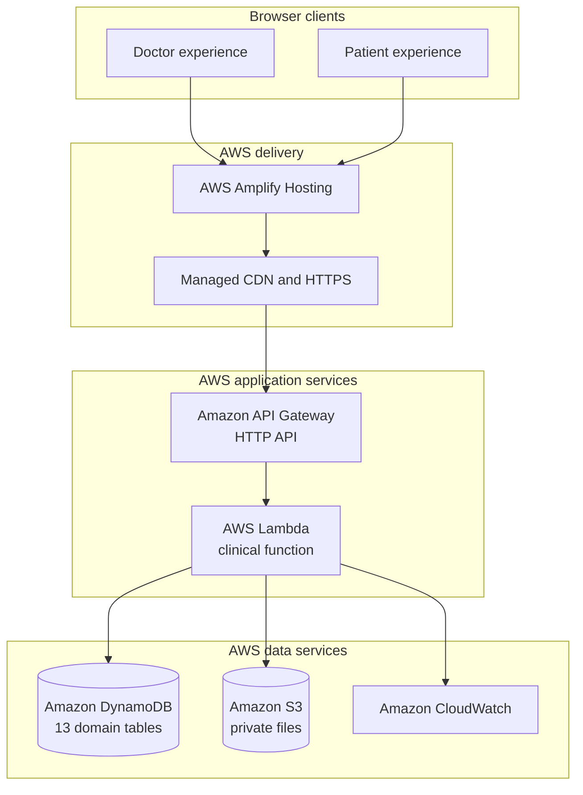
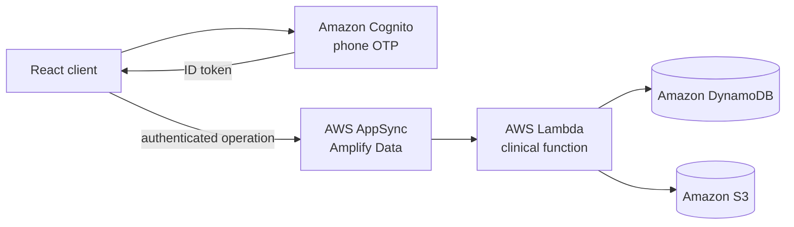
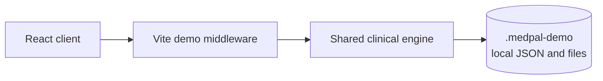
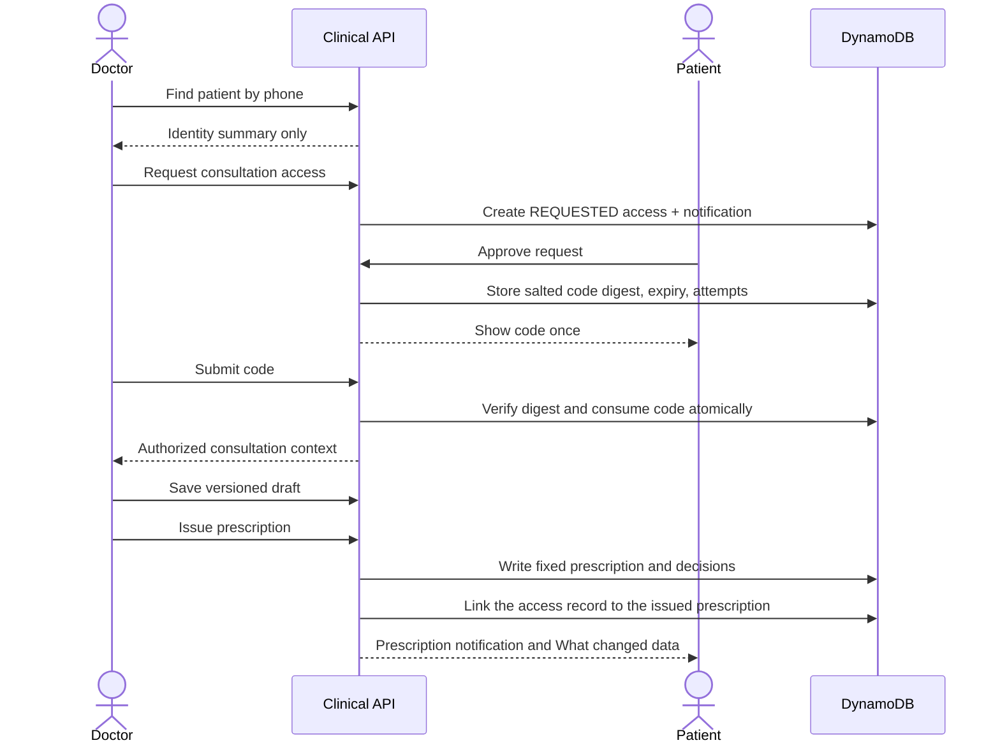

# MedPal architecture

This document describes the architecture implemented for the MedPal hackathon build, the trust boundaries it enforces, and the explicit differences between demonstration behaviour and a production rollout.

## System goals

MedPal is designed around five guarantees:

1. A patient controls when a doctor can open their clinical context.
2. Access is limited to one doctor, one patient, and one consultation.
3. Medication changes are recorded as decisions rather than destructive edits.
4. An issued prescription becomes a fixed historical snapshot.
5. Private documents are never exposed as public S3 objects.

## Runtime architecture

### Hosted demonstration

The hosted demo's authentication code is displayed inside the product so judges can use it without SMS delivery. The demo gateway is created only when the backend is deployed with `MEDPAL_DEMO=true`. Lambda also rejects the demo route unless `DEMO_ENABLED=true` exists in its environment.

### Production-oriented path in the repository

The GraphQL surface exposes named clinical operations instead of allowing the browser to write clinical tables directly. Cognito claims are converted to a small server identity containing the subject, verified phone state, and reviewer groups. A real launch would additionally require production SMS configuration, operational credential review, medical and legal review, monitoring, recovery exercises, and a formal privacy programme.

### Local development

The local adapter and Lambda adapter call the same clinical engine. Only the persistence, authentication, and file adapters change. This lets contributors run the complete workflow without an AWS account while testing the same consent and issuance rules.

## Consultation authorization flow

The plaintext consultation code is returned to the approving patient and is never persisted. DynamoDB stores a salted SHA-256 digest. Comparison uses a timing-safe function. A code expires after five minutes, permits five attempts, and becomes unusable after successful verification.

## Clinical write model

All sensitive operations run through `amplify/functions/clinical/engine.ts`.

### Draft stage

A consultation access record contains the working draft and a revision number. Every save supplies the revision the doctor last read. DynamoDB conditional transactions reject a stale write, preventing one browser tab from silently overwriting newer work from another.

Each existing medicine receives exactly one decision:

- `CONTINUE` keeps its clinical fields unchanged;
- `CHANGE` records a replacement instruction and a reason;
- `STOP` records the stop decision and a reason;
- `NOT_REVIEWED` preserves an unresolved item in the draft; and
- `ADD` creates a new medicine rather than pretending it replaced an existing one.

### Issuance stage

Issuance validates the complete draft, creates the prescription, prescription items, and medication decisions, and stores an integrity digest over the issued snapshot. The issued record is not edited in place. A later correction must be represented as a new version linked through `correctsPrescriptionId`.

The PDF is generated from the issued snapshot, stored under a private S3 key, and returned through a short-lived signed URL after server-side ownership checks.

## Data model

Amplify Data provisions one DynamoDB table for each model. The Lambda receives table names through environment variables and performs indexed queries and transactional writes through the AWS SDK.

| Model                 | Purpose                                                      | Important relationships and lifecycle                                                        |
| --------------------- | ------------------------------------------------------------ | -------------------------------------------------------------------------------------------- |
| `User`                | Account identity and role                                    | Indexed by phone; linked to a Cognito subject in the production path                         |
| `DoctorProfile`       | Qualifications, specialty, registration, verification status | One per doctor account                                                                       |
| `PatientProfile`      | Demographics, language, and avatar                           | One per patient account                                                                      |
| `Clinic`              | Letterhead identity and contact details                      | Referenced by doctor, consultation, and prescription                                         |
| `VerificationRun`     | Credential upload and review result                          | Keeps the private S3 key and review outcome                                                  |
| `ConsultationAccess`  | Consent state, expiry, attempts, and draft revision          | Scoped to doctor + patient + consultation; expires automatically or can be explicitly closed |
| `Consultation`        | Clinical encounter metadata                                  | Indexed by patient and doctor                                                                |
| `Prescription`        | Versioned issued snapshot and integrity digest               | Indexed by patient, doctor, and consultation; immutable after issue                          |
| `PrescriptionItem`    | Issued medicine instructions                                 | Child of a prescription; immutable with its parent                                           |
| `MedicationDecision`  | Continue/change/stop/add explanation                         | Connects the before and proposed treatment states                                            |
| `Notification`        | Consultation requests and issued-prescription notices        | Indexed by recipient                                                                         |
| `AuditEvent`          | Security and clinical action trail                           | Indexed by consultation where applicable                                                     |
| `MedicationUseReport` | Patient-reported medicine context                            | Owned and readable by the patient                                                            |

The domain snapshot is stored alongside indexed fields. This keeps rendering and domain evolution straightforward while preserving efficient lookup keys.

## Record ownership and immutability

| Record              | Who can read it                                           | Who can write it | Becomes fixed when             |
| ------------------- | --------------------------------------------------------- | ---------------- | ------------------------------ |
| User/profile        | The owning account                                        | Clinical Lambda  | Replaced by a new revision     |
| Consultation access | Patient; doctor only through an authorized operation      | Clinical Lambda  | Closed or expired              |
| Consultation draft  | Authorized doctor within active access                    | Clinical Lambda  | Prescription is issued         |
| Prescription        | Patient; issuing doctor through checked operation         | Clinical Lambda  | Immediately on issuance        |
| Prescription item   | Same as prescription                                      | Clinical Lambda  | Immediately on issuance        |
| Medication decision | Patient; issuing doctor through checked operation         | Clinical Lambda  | Immediately on issuance        |
| Credential file     | Reviewer through a signed URL                             | Clinical Lambda  | Stored under final private key |
| Prescription PDF    | Authorized patient or issuing doctor through a signed URL | Clinical Lambda  | Created from issued snapshot   |

The public demo relaxes only identity proof and professional verification. It does not bypass the patient-consent gate for clinical history.

## File security

The S3 bucket has no direct browser access rule. Upload and download access is brokered by Lambda:

1. the doctor requests an upload for a supported MIME type and declared size;
2. Lambda creates a five-minute signed upload URL under that doctor's temporary prefix;
3. after upload, Lambda reads the object and verifies its byte length and magic signature;
4. validated content is copied to a private final key with AES-256 server-side encryption and create-only semantics; and
5. a reviewer or authorized prescription viewer receives a short-lived signed download URL.

PDF, PNG, and JPEG are supported, with a 10 MB limit.

## Browser and API security

- HSTS requires HTTPS for future visits.
- Content Security Policy limits scripts, styles, images, connections, frames, and form targets.
- `X-Frame-Options: DENY` and `frame-ancestors 'none'` prevent clickjacking.
- `X-Content-Type-Options: nosniff` disables MIME sniffing.
- `Referrer-Policy: no-referrer` prevents URL leakage through referrers.
- `Permissions-Policy` permits the camera only for the same origin and disables microphone and geolocation.
- The hosted demo login endpoint rate-limits requests per source IP and minute.
- Session tokens and authorization responses are returned with `Cache-Control: no-store`.
- Unexpected server errors are logged by type and operation; stack traces and internal AWS details are not returned to the browser.

## Notifications and consistency

Notifications are durable records in DynamoDB. The patient interface polls the home operation every two seconds while signed in and refreshes when the browser regains focus. This makes the demo reliable across ordinary browsers without requiring a WebSocket subscription.

For a production release, AppSync subscriptions or a dedicated push channel could reduce polling and support background delivery. The durable notification record should remain the source of truth.

## Availability and cost choices

The current architecture is serverless and scales to zero or near-zero when idle:

- static assets are delivered through managed hosting and CDN infrastructure;
- API Gateway and Lambda charge per use;
- DynamoDB uses managed capacity rather than a database server;
- S3 stores only uploaded documents and generated prescriptions; and
- CloudWatch centralizes Lambda diagnostics.

DynamoDB point-in-time recovery is enabled and table removal policies retain data if the sandbox infrastructure is replaced. The trade-off is that the sandbox still needs lifecycle and cost monitoring so retained hackathon data does not accumulate indefinitely.

## Deployment modes

| Mode                | Command                         | Identity/API                               | Persistence         | Intended use                     |
| ------------------- | ------------------------------- | ------------------------------------------ | ------------------- | -------------------------------- |
| Local demo          | `npm run demo`                  | Simulated login over local Vite middleware | `.medpal-demo`      | Contributor and judge evaluation |
| Hosted demo         | `npm run build:demo`            | Simulated login over API Gateway           | AWS DynamoDB and S3 | Public hackathon URL             |
| Production-oriented | `npm run dev` / `npm run build` | Cognito and AppSync                        | AWS DynamoDB and S3 | Foundation for a real deployment |

## Known gaps before real clinical use

- Replace simulated verification with registry integrations and an operational reviewer workflow.
- Configure production OTP delivery, abuse controls, account recovery, and verified role assignment.
- Complete legal, privacy, data-retention, patient-consent, and medical-device assessments for the target jurisdiction.
- Add structured allergy, contraindication, and interaction data with clinically validated sources.
- Expand the medicine catalogue for India and establish drug-database licensing.
- Add multilingual embedded fonts to generated PDFs.
- Add backups, disaster-recovery objectives, alarms, dashboards, and incident procedures.
- Perform independent penetration testing and threat modelling.
- Replace polling with real-time subscriptions or push notifications where appropriate.

These are deliberate boundaries, not claims that the hackathon demonstration is ready to handle protected health information.
